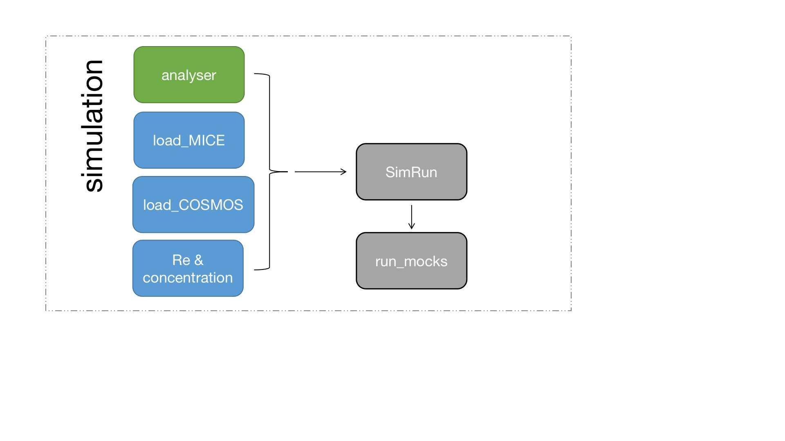

# SLens
## Introduction

Galaxy-galaxy strong lensing simualtion package. Assuming all lenses are axis-symmetric, whose mass density profiles can be modelled by a gnfw+Sersic model.
Lens galaxy catalogue:
[Crocce, M., Castander, F. J., Gaztañaga, E., Fosalba, P., & Carretero, J. 2015,
MNRAS, 453, 1513](https://arxiv.org/abs/1312.2013)
Source galaxy cataglogue:
[Laigle, C., McCracken, H. J., Ilbert, O., et al. 2016, ApJS, 224, 24](https://arxiv.org/abs/1604.02350)
## Modules

