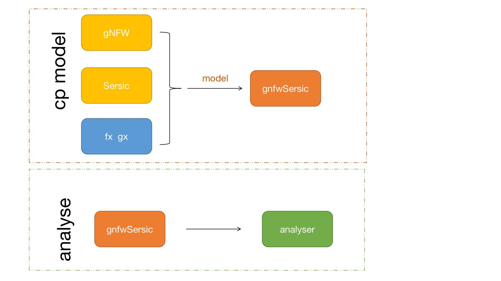
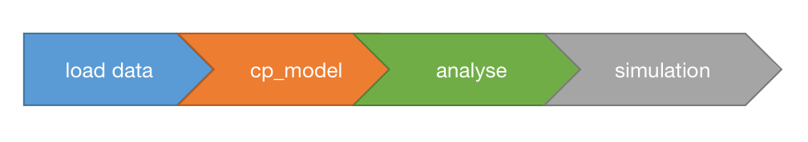
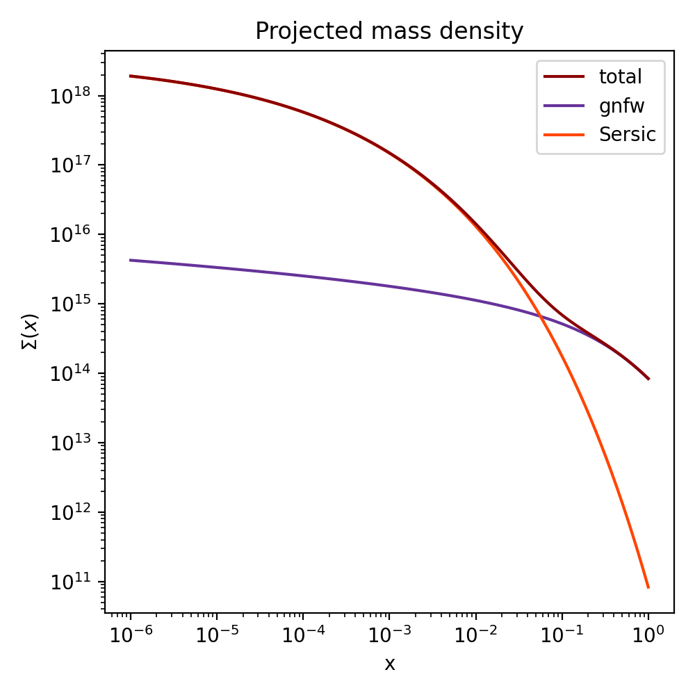
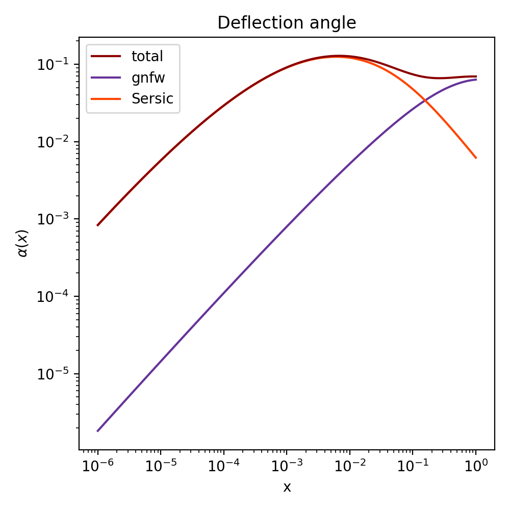
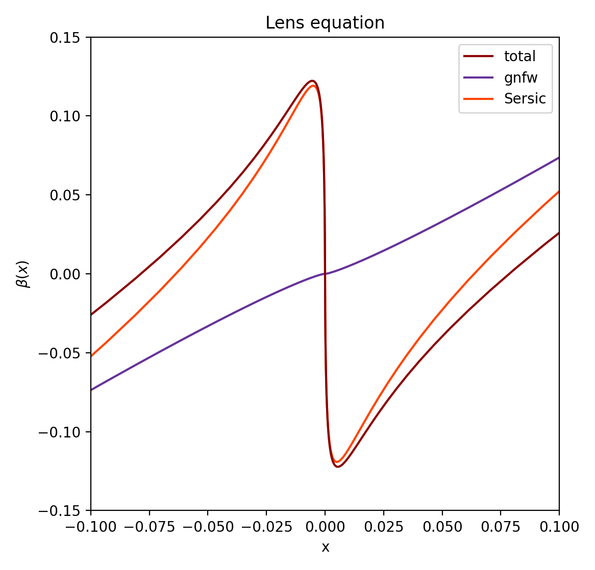
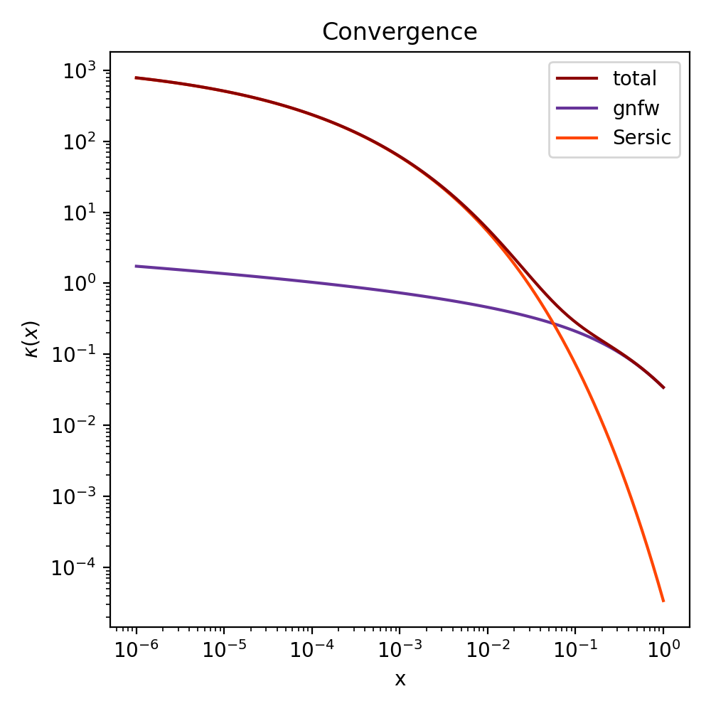
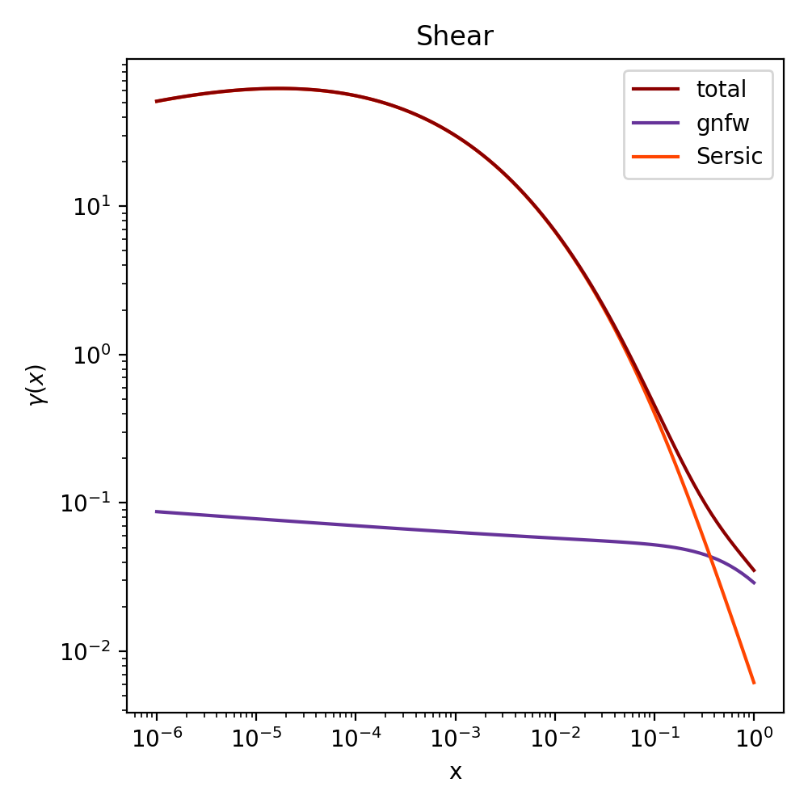

# SLens
## Introduction

Galaxy-galaxy strong lensing simualtion package. Assuming all lenses are axis-symmetric, whose mass density profiles can be modelled by a gnfw+Sersic model.
## Data
Lens galaxy catalogue:

[Crocce, M., Castander, F. J., Gaztañaga, E., Fosalba, P., & Carretero, J. 2015,
MNRAS, 453, 1513](https://arxiv.org/abs/1312.2013)

Source galaxy cataglogue:

[Laigle, C., McCracken, H. J., Ilbert, O., et al. 2016, ApJS, 224, 24](https://arxiv.org/abs/1604.02350)

## Basic models

- gNFW:

refer: Resolving the Central Density Profile of Dark Matter Halos Gravitational Lensing Statistics by Masamune Oguri, section E.1.5
- Sersic:

refer: [Sonnenfeld, A. & Cautun, M. 2021, A&A, 651, A18](https://arxiv.org/abs/2102.08973)
section 3.1
- concentration:

[Ludlow, A. D., Bose, S., Angulo, R. E., et al. 2016, MNRAS, 460, 1214](https://arxiv.org/abs/1601.02624) appendix c
- mass-size:

[Sonnenfeld, A., Wang, W., & Bahcall, N. 2019, A&A, 622, A30](https://arxiv.org/abs/1811.04934) section 3.1
- angular diamter distance:

[Hogg, David W. "Distance measures in cosmology." arXiv preprint astro-ph/9905116 (1999).](https://arxiv.org/abs/astro-ph/9905116) section 6

## Modules

## Workflow

## Analysing composite (gnfw+Sersic) lens statistics

One can analyse the lens statistics using the <code>lens_statistics</code> module as provided in the tutorials.
The lens statistics (as functions of the dimensionless radial coordiate  ) are:
- : the projected mass density;
- : the deflection angle;
- : the lens equation, which describes the mapping from the lens plane  to the source plane ;
- : the convergence, which describes the magnification of the image by increasing its size;
- : the shear, which describes the how much the shape of the image is changed tangentially.

